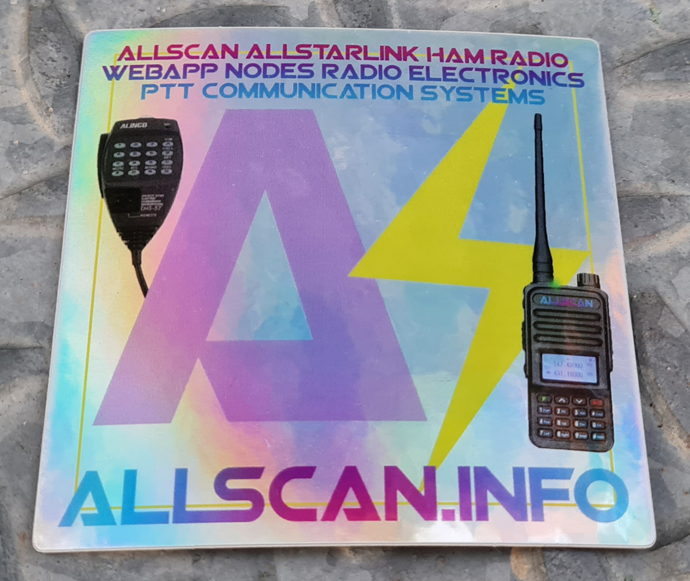

# AllScan
AllStar Favorites Management &amp; Scanning Web App

See [screenshot.png](https://github.com/davidgsd/AllScan/blob/main/screenshot.png) for an example of the AllScan GUI. AllScan is a free and open-source web app that provides Favorites Management features, AllStarLink Stats integration, and connection monitoring and control functions.
* Shows your favorites in a Dashboard summary table with Keyed status, Connected Node count and other statistics.
* Continually scans the status of each favorite using ASL's Statistics API and shows which favorites are active and have recently been active.
* Allows favorites to be connected with a single click (optionally automatically disconnecting any currently connected nodes first).
* Allows the Favorites Table to be sorted by Node#, Name, Description, Location, etc.
* Favorites can be added/deleted simply by entering the node# and clicking a button.
* Favorites files/groups can be easily created, copied, backed up, uploaded, downloaded and switched between

These features give AllStar nodes similar memory management and scan capabilities that analog radios have had for decades. AllScan is mobile-friendly and optimized for ease of use on both small and large screens. AllScan follows the latest web development standards, with PHP, JavaScript, SQL, HTML, and CSS cleanly partitioned, runs on both ASL and HamVOIP, and is simple to install, configure, and update.

Prior to installing AllScan it is recommended that you have a working install of Supermon or Allmon. Currently AllScan supports favorites.ini entries that refer to connecting to nodes eg. 'cmd[] = "rpt cmd %node% ilink 3 [node#]"' but may also support other types of commands in the future.

As AllScan receives data from the ASL stats server it updates the Favorites Table rows with color coded details showing the following:

Color codes for '#' column:
* Red: Node is keyed or was recently keyed (transmitting audio). Brighter shades indicate a higher percentage of time keyed over the past few minutes
* Medium Green: Node Active, Web-Transceiver enabled (may be more likely to accept connections)
* Dark Green: Node Active (registered and reporting to AllStarLink Network)

Color codes for 'Node' column:
* Dark Green: Node is currently connected

'Rx%' column: The remote node's reported TxTime divided by its Uptime, provides a general indication of how busy the node tends to be.

'LCnt' column: The reported number of Connected Links (ie. user nodes, hubs, bridges, or other links).

ASL's stats APIs are limited to 30 requests/minute per IP Address. AllScan uses a dynamic request timing algorithm to prevent exceeding this limit, even if multiple web clients are using AllScan on a node.

AllScan also implements User Authentication, User Account Administration, Login/Logout, User Settings and Cfg Management functions. After install AllScan will automatically create its database and necessary tables, and when you first visit the allscan/ url will prompt you to create an Admin user account. By default, public (not logged-in) users will have Read-Only access and will be able to see the Connection Status and Favorites data, but will not be able to make changes or view any admin (Cfgs / Users) pages. To change this setting, Log in, click the "Cfgs" link, and edit the "Public Permission" parameter.

Additional screenshots:
[init.png](https://github.com/davidgsd/AllScan/blob/main/docs/screenshots/init.png)
[cfgs.png](https://github.com/davidgsd/AllScan/blob/main/docs/screenshots/cfgs.png)
[users.png](https://github.com/davidgsd/AllScan/blob/main/docs/screenshots/users.png)
[settings.png](https://github.com/davidgsd/AllScan/blob/main/docs/screenshots/settings.png)

Multiple copies of AllScan can be installed on one node (server) if desired, each with their own separate configuration, Favorites, and/or different node numbers. Just make copies of the /var/www/html/allscan/ dir eg. to "allscan2" and update the config settings accordingly on the Cfgs Tab.

# Pre-Install Notes
It is highly recommended to use ASL3 and to have Allmon3 or Supermon properly configured and working. AllScan works great on HamVOIP and older ASL versions but ASL3 has numerous major improvements and supports x64 platforms. If you have Supermon installed AllScan will give you the option to use the favorites.ini file in the supermon directory. See the Supermon groups.io page for details on how to install Supermon. If you use Supermon2 instead of Supermon or want to put your favorites.ini file in some other folder, the favorites.ini search location(s) can be set on the AllScan Cfgs Page.

# Install / Update
The AllScan Install/Update script automatically checks system configuration details, checks if AllScan is already installed and what version, and if a newer version is available will prompt you to continue with the Install/Update. Just enter 'y' and seconds later the install/update will be complete.

Log into your node by SSH and run the following commands:

	sudo apt update; sudo apt install php php-sqlite3 php-curl unzip avahi-daemon asl3-tts -y
	cd ~; rm AllScanInstallUpdate.php 2>/dev/null
	wget 'https://raw.githubusercontent.com/davidgsd/AllScan/main/AllScanInstallUpdate.php'
	chmod 755 AllScanInstallUpdate.php
	sudo ./AllScanInstallUpdate.php

The Install/Update script will provide detailed status messages on each step of the process. Carefully review all output messages and confirm no errors occur.

Now open a browser and go to your node's mDNS or IP address followed by /allscan/, eg. `http://[hostname].local/allscan/` and be sure to add a browser bookmark. (It is recommended to set your node's host name to 'node' followed by your node# eg. 'node567890'. You can check the host name with the 'hostname' command, and can change the host name by running 'sudo hostnamectl set-hostname [new hostname]'.) If the node's IAX port is forwarded in your router it can be accessed from the internet at `http://[node#].nodes.allstarlink.org`.

If you did a new install AllScan will prompt you to create an admin account. Be sure to do this right away. You can then configure the permission settings for AllScan. These default to Read-Only for public (not logged-in) users. This setting can be changed on the "Cfgs" page.

If you did an update, **force a browser reload by pressing CTRL-[F5] or clearing your browser cache, or in mobile browsers do a long-press of the reload button**, so your browser will load any updated JavaScript and CSS files.

NOTES:
1. You may need to uncomment/add the following lines in /etc/php/php.ini (make sure they do not have a ';' in front) 
	extension=pdo_sqlite 
	extension=sqlite3
2. Then restart the web server or restart the node

# AllScan Nodes, Accessories and How-To-Guides
If you do not yet have a node or might like to upgrade your node, see [AllScan.info](https://allscan.info/) for How-To Guides, Nodes, USB Radio Interfaces, Radio modules, Radio-less interfaces, Accessories and more.

AllScan nodes, node modules, and USB interfaces provide extensive features and outstanding audio quality - see the [Products Page](https://allscan.info/products/) for details.

# Configuration Files and Parameters
Files used by AllScan:
1. **astdb.txt**: The ASL database file with the list of all nodes provisioned on the AllStarLink network. In ASL3 this is maintained by the asl3-update-nodelist service which will be set up automatically by the AllScan Installer/Updater script. In ASL2/HV this file should already exist in ../supermon/astdb.txt or /var/log/asterisk/astdb.txt. If the file is not found it will be automatically downloaded into the allscan directory. AllScan shows the status of these files and their last modification times in the status messages box (below the Favorites Table).
2. **global.inc**: Cfg file in the supermon directory with user settings such as your name, call sign, node title, etc. AllScan will automatically import the following variables from global.inc if found: $CALL, $LOCATION, and $TITLE2. Otherwise you will be prompted to enter them after first setting up AllScan. The Call Sign and Location parameters are shown in the AllScan Page Header, and the Node Title parameter is shown in the Connection Status Table header.
3. **favorites.ini**: The favorites file can be found in the supermon directory or in the allscan directory. Or if you have the file somewhere else (eg. ../supermon2/) you can set that location in the 'Favorites.ini Locations' Cfgs Parameter. A sample favorites file is also included.

All AllScan Cfg parameters can be viewed and set on the Cfgs page if you are logged in as an Admin user. Just click the 'Cfgs' link and all Cfgs are then shown along with an Edit form.

# Troubleshooting
For any issues including directory/file permissions issues or issues with SQLite not being available it is recommended to run the update script, which will check if you have the latest version of AllScan, update your install if not, and validate all directory and file permissions. Refer to the "Install / Update" section above, run the update script, reboot the node, and then see if the issue was resolved.

If you have somehow corrupted your install and running the install/update script does not fix it, run "sudo rm -rf /etc/allscan /var/www/html/allscan /srv/http/allscan 2>/dev/null" to completely uninstall AllScan, and then run the installer again.

A common fix for many issues is simply to reboot your node. You might be surprised how many issues end up being resolved with nothing more than a reboot.

Be sure to check out the [Ham Radio Crusader YouTube channel AllScan videos](https://www.youtube.com/@HamRadioCrusader/search?query=AllScan) for more details and a walkthrough of how to install, set up and use AllScan on ASL3, HamVOIP or DVSwitch.

HamVOIP users: See this [Blog Post by KJ7T](https://randomwire.substack.com/p/updating-allscan-on-the-clearnode) for detailed steps on how to enable the SQLite3 extension in php.ini.

If you have other issues with your node that are not related to the AllScan web app itself be sure to review the ASL config file settings listed in my How-To Guides at [AllScan.info](https://allscan.info/). Be sure to verify you have made ALL the settings shown in the appropriate guide for your node type (radio-less / HT / mobile radio).

If you are still unable to get things working after trying the above, **email me** at the contact info below and provide as much detail as possible on the issue you see along with the following info:
1. All messages shown when you run the install/update script.
2. Directory listing of the web root folder and the allscan folder. Do this by running "cd /var/www/html; ls -la . allscan" (or for HamVOIP "cd /srv/http; ls -la . allscan").

For fastest response support requests / questions / inquiries should be emailed to me, rather than posted on FB or github.

# Contact
If you have any questions email david at allscan.info. Also see [AllScan.info](https://AllScan.info), and the [AllScan FB Group](https://www.facebook.com/groups/allscan). Note that any tech support questions should be emailed to me &ndash; not posted to the FB group.

# Donations
To contribute to AllScan feel free to send any amount by paypal, venmo or zelle to chc_media at yahoo.com. Even $5 does help cover expenses and enable me to spend more time on further development and new features. Thank you for your support, and with helping spread the word about AllScan and ASL.

AllScan stickers are now available and are also a great way to help support the project and spread the word. These are 3"x3" UV-resistant outdoor-rated stickers on an iridescent metallic material with permanent adhesive. One sticker is included at no charge with any order of an AllScan product at [AllScan.info](https://allscan.info) or stickers can be purchased separately for $5 ea., 3 for $10, or 10 for $20, with free US shipping or for outside the US add $5 shipping. These can be ordered on my website or with the above Donate button (specify Sticker Qty in comments).

# Road Map
As of version 0.65, AllScan implements the main features I originally planned, and works very well for the use case of personal nodes that have one or two primary users and/or a small number of occasional other users. A future version of AllScan will add enhanced support for a larger number of simultaneous web-client users (which will require ASL stats caching so that numerous web-clients would not each be making separate ASL stats requests which would significantly slow down the stats scanning functions). However this is not a common use case and is not a current priority. AllScan will also at some point more fully support nodes with more than one node number eg. allowing the local node to be selected from a select box control. Other changes planned:
1. Enhanced Favorites management features, saving favorites in AllScan DB rather than in other folders, editing favorites text, reordering table.
2. Enhanced stats features, caching of stats data to AllScan DB
3. Other features that are highly requested or that seem like a good idea

# Release Notes
**v0.97 2025-09-03** 
Add Custom Cmd Buttons configuration parameter that allows DTMF command buttons to be shown on the main AllScan page (next to the Node Stats and Restart Asterisk buttons). This can be set on the Cfgs tab. Example settings:
<pre>"*712" - Show a simple command button to say the time of day
"Say Time *712" - Same as above but with descriptive text
"Parrot On *921, Parrot Off *922, Say Time *712" - Multiple commands (comma separated)</pre>

**v0.96 2025-08-30** 
Use of allmon.ini files has now been removed. Node# and AMI Cfgs can now be set on the Cfgs Tab, or if not set there will be read from /etc/asterisk/ rpt.conf and manager.conf.

**v0.95 2025-08-18** 
Fix issue in last checkin where Connection Status table would not be updated on some nodes with ASL2/HV .ini files.

**v0.94 2025-08-15** 
Support reading non-default AMI port# from Allmon3 .ini files. Discontinue copy of /etc/allmon3/allmon.ini to /etc/asterisk/allmon.ini.php during install as manager.conf should always have valid AMI cfgs.

**v0.93 2025-05-13** 
Fix bug introduced in v0.90 where for non-logged-in users JavaScript functions would not work.

**v0.92 2025-05-05** 
When loading main page check if a newer AllScan version is available and if so display a lighting bolt icon link next to the version number in the page header. This link then opens the AllScan github page and update instructions. JS optimizations to prevent duplicate error messages eg. if node is offline.

**v0.91 2025-05-04** 
Optimizations to JavaScript that highlights Favs table node column cells for connected nodes. Optimizations to install/update script.

**v0.90 2025-05-01** 
Highlight Node column cell in Favorites Table if node is currently connected. Add example files showing how to set up DTMF commands as used in AllScan nodes - see docs/rpt.conf and extensions.conf. Enhancements to install/update script to install additional utilities including avahi-daemon and asl3-tts, and to update php.ini if needed to enable SQLite3.

**v0.89 2025-03-02** 
Enable nodes to be connected by double-clicking on node# links. This has the same effect as single-clicking a node# and then clicking the Connect button.

**v0.88 2024-11-07** 
Enable reading AMI cfgs from rpt.conf and manager.conf if not found in .ini search locations.

**v0.87 2024-10-18** 
Fix bug where on new installs on nodes with no existing favorites files the main page would not fully load. Other minor optimizations.

**v0.86 2024-10-15** 
Add Favorites File Management functions to the Cfgs Tab, and a Favorites File Select control to the main page. These functions support viewing, downloading, copying, deleting, renaming and uploading favorites files, and enable simple switching between them. Simplify entry of node Call Sign, Location and Title configs for installs that do not have a Supermon global.inc file.

**v0.83 2024-09-12** 
Show additional messages in the log window at startup including which ASL channel driver is enabled, audio gain settings, and ASL RxAudioStats support.

**v0.81 2024-08-26** 
Updates to AMI parser to auto-detect Asterisk version and support differences in some commands in ASL2/3. Restart Asterisk button now works with ASL3. Display ASL version in messages window at startup. Fix issue where in ASL3 after Asterisk restart AMI stats error messages could repeat indefinitely, in this event AllScan will now reload. Update default favorites.ini file. Fix some php log warning messages.

**v0.75 2023-11-05** 
Update install/update script with changes from WA3WCO to support additional Linux versions.

**v0.74 2023-10-03** 
Support reading temp sensor on RPi2's. Readme updates.

**v0.73 2023-08-23** 
Allow account email addresses from domain names with long suffixes. Add checks to prevent some possible "Undefined array key" PHP warning messages.

**v0.72 2023-06-18** 
Add functions for checking free and total disk space, and log files > 50MB in size. Display this info in startup messages. Add _tools/checkFs.php script which can be called to delete any files in /var/log/ or /var/log/asterisk > 50MB in size. This is not called from AllScan but can be called from cron by running 'sudo crontab -e' and adding a line similar to "0 * * * * (/var/www/html/allscan/_tools/checkFs.php cron)" to the bottom of the file, to check for and delete excessively large log files once per hour. These features can help monitor free disk space and take corrective action if space is running low.

**v0.70 2023-05-20** 
Implement retrieval of EchoLink node name/callsign data from AMI for display in the Favorites and Connection Status tables. Handle issue where astdb.txt file downloads (downloaded by Allmon/Supermon astdb.php script) can sometimes fail resulting in a 0 byte file. AllScan will now detect this, show a useful log message, check other file locations or download the file if needed.

**v0.68 2023-03-25** 
Allow EchoLink Node #s to be Added to Favorites.

**v0.66 2023-02-27** 
Fix issue where DTMF command function would not accept digits A-D. Note that for mobile browsers the Node#/Command text field is specified as inputmode="tel" so that a numeric keypad with large keys appears on phones, making it easier to type in node numbers. For a standard keyboard (supporting letters ie. A-D), delete the "inputmode="tel"" text from include/viewUtils.php line 35.

**v0.65 2023-01-28** 
Update handling of JS offline/online and EventSource error events to reinit EventSource and Stats functions rather than reload page. Update Favs table sort function to use case-insensitive string sort option.

**v0.59 2023-01-23** 
Support old PHP versions (< 7.3.x) setcookie function w/SameSite parameter. Fixes login issues in v0.53-0.58 on nodes with < PHP 7.3. Enable cookie options to be set with cookieSameSiteOpt and cookieUseRootPath variables in include/UserModel.php.

**v0.56 2023-01-22** 
Optimizations to Keyed node status detection. ASL stats API data for many nodes shows a 0 stats.keyed value even when the node is in fact keyed. Testing revealed that stats.totalkeyups count and stats.totaltxtime are usually valid however and thus keyed status can be detected from changes in these values between stats requests. Implement moving average calculation of Tx activity level based on stats.keyed or total time keyed divided by elapsed time between the 2 most recent stats requests. The Favorites Table '#' column for each node is now highlighted in a variable shade of red corresponding to the average Tx activity over the past few minutes.

**v0.53 2023-01-21** 
Performance optimizations. Fix issue that would cause an unnecessary database write on every page load/stats request for logged-in users. Fix JS console warning re. no SameSite cookie parameter. Specify AllScan's dir ($urlbase/) for cookie paths.

**v0.51 2023-01-18** 
Optimizations to Cfgs module. Add 'DiscBeforeConn Default' Cfg parameter which determines if the 'Disconnect Before Connect' checkbox is checked by default. To have the checkbox be Off by default, go to the Cfgs page and set 'DiscBeforeConn Default' to Off.

**v0.49 2023-01-16** 
Add user authentication and permissions checks to all API files. Add DTMF command button. Updates and optimizations to installer/updater: Fix issue where updater would exit prior to completing all checks if install was up-to-date, provide more detail about all commands executed, prompt user before executing any apt-get/pacman update/upgrade actions.

**v0.48 2023-01-11** 
Implement User Authentication, User Admin, Login/Logout, User Settings and Cfg Management functions. Major refactoring and additions. AllScan now defaults public (not logged-in) users to Read-Only access. This can be changed to None (no public access), Read/Modify, or to Full (no logins needed). Upon install of this version, AllScan will automatically verify the system configuration, create its Database and necessary tables.

**v0.4 2023-01-02** 
Only show CPU Temp if data is available. Update InstallUpdate script to verify favorites.ini file in supermon dir is writeable by web server if dir exists. Add API to eventually support stats caching and additional stats features. Update CPU temp data once per minute.

**v0.38 2022-12-24** 
For EchoLink nodes don't link node Name text to ASL stats page. Revise Green/Yellow CPU Temp range threshold from 120 to 130 °F. Support 7-digit (EchoLink) node numbers when reading in favorites.ini. Fix issue where stats request scanning would stop once it reached an EchoLink node number in the Favorites Table. Properly handle case of invalid node number in favorites file. Download ASTDB file if not found in allscan, allmon or supermon locations.

**v0.35 2022-12-21** 
Optimize stats request timing to more quickly populate the favorites table after page load, then go to a reduced request rate over time, to reduce the chance of the ASL stats request limit (30 per minute) being exceeded if there are multiple AllScan web clients on a node. Link Favorites table Names text to the ASL stats page.

**v0.3 2022-12-19** 
Implement ASL Stats functions, color coding of Favorites Table and new 'Rx%' and 'LCnt' columns. Enable automatic reading of astdb.txt file from allscan's directory or from ../supermon/ or /var/log/asterisk/.

**v0.23 2022-12-18** 
Add print of astdb.txt file Last Update times. CSS optimizations. Add Asterisk Restart button. Improvements to log messages. Support Disconnect before Connect feature. This sends AMI an 'rpt cmd ilink 6' (Disconnect all links) command and waits 500mS before executing a Connect request, if 'Disconnect before Connect' checkbox is checked and any nodes are connected.

**v0.2 2022-12-15** 
Add Asterisk API. Code refactoring. Add Message Stats div, set up JS functions to output detailed status and error messages during all event processing. Add info links and CPU temp display. Enable sortable columns on Favorites Table. GUI Updates.

**v0.1 2022-12-13** 
Initial Commit.

# FAQs
Q: How can the Admin user password be reset? 
A: If you have only one admin user defined (Superuser permission level) and lose the password, the only way to reset it is to delete the AllScan database file. This can be done by executing "sudo rm /etc/allscan/allscan.db" by SSH. This will delete ALL AllScan User accounts and Cfgs.

Q: Will AllScan at some point be able to directly scan nodes ie. by connecting to nodes in the Favorites list and scanning through the list until activity is found? 
A: I had originally intended to implement such a feature but it turns out that it is not needed, and could cause issues. Unlike a radio which can scan any number of memory channels quickly and easily, making connections on AllStar requires IAX connections to be opened, which results in connection announcements on some nodes and systems. I would not want AllScan to be the cause of any annoyance to repeater system admins or users if frequent "Node X Connected" messages were broadcast every time a user enabled scanning. ASL's statistics database and API enables AllScan to show reliable Tx & Rx activity stats without needing to directly connect to any nodes, and this has enabled my original goals for AllScan to be achieved in a simple and efficient way. 
Also, checking a list of nodes for activity can be done in a more direct way using the Local Monitor function. For example you could set up a 2nd node where you do a permanent Local Monitor connect to all nodes you want to monitor, and then monitor that on a separate node or with an IAX/SIP phone/app. You can then monitor the "monitoring" node and if you hear a call, a net or something else interesting then switch to your main node and connect to the active node there. You probably wouldn't want to connect to more than a handful of nodes at a time in Local Monitor mode but it could be a good way to monitor 5 or so nodes simultaneously and not miss any activity. The 2nd node could even be a cloud Linux server with no node hardware needed. Just monitor it through a VOIP phone app such as "Linphone".

Q: What is the blinking icon for? 
A: AllScan's blinking 'lighting bolt' icon toggles on/off as each Connection Status event message is received from the node (ie. from AllScan's astapi/server.php file which reads status info from a socket connection to Asterisk on the node and then forwards that data every 500mS to AllScan's JavaScript in the browser.) If it stops blinking that means there is a communication issue between the browser and your node.

Q: If I ever wanted to uninstall AllScan how can this be done? 
A: To uninstall, delete the allscan folder in the web server root directory (/var/www/html/ on ASL or /srv/http/ on HamVOIP). cd to that folder, then execute "sudo rm -rf allscan" to delete the AllScan folder. AllScan also keeps a database file in /etc/allscan/ that can be deleted by executing "sudo rm -rf /etc/allscan".

# Thanks
Thanks to all ASL Developers, to the numerous hams who have helped with Beta testing, and to all repeater owners who have integrated AllStar.
